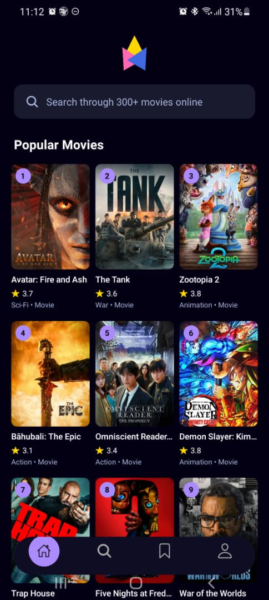
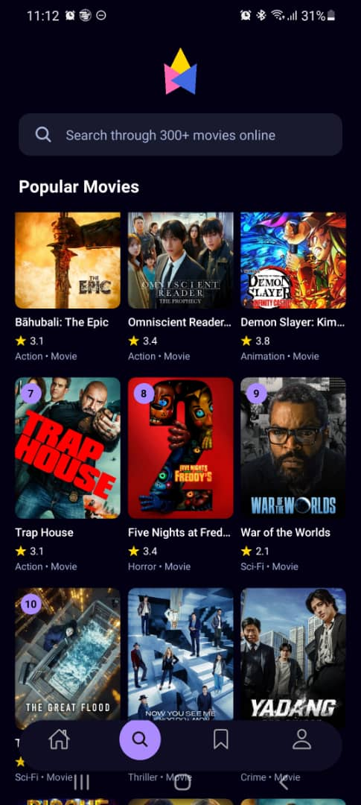
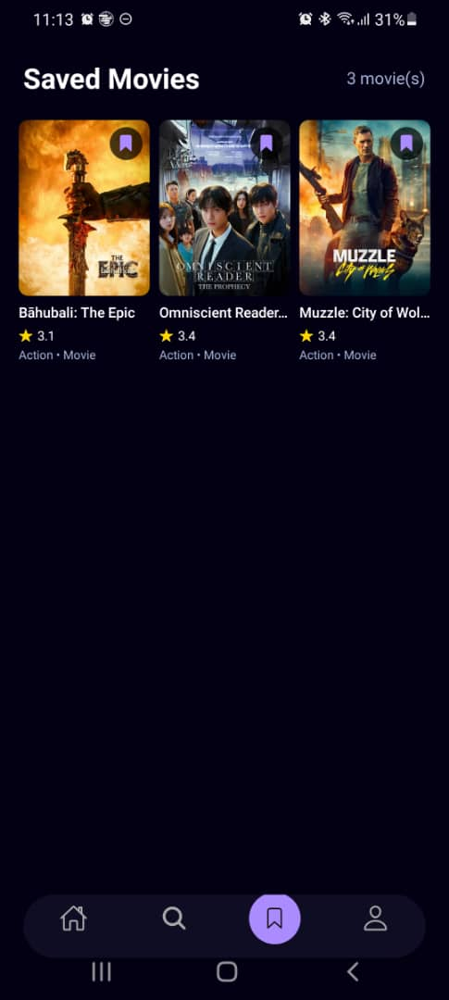
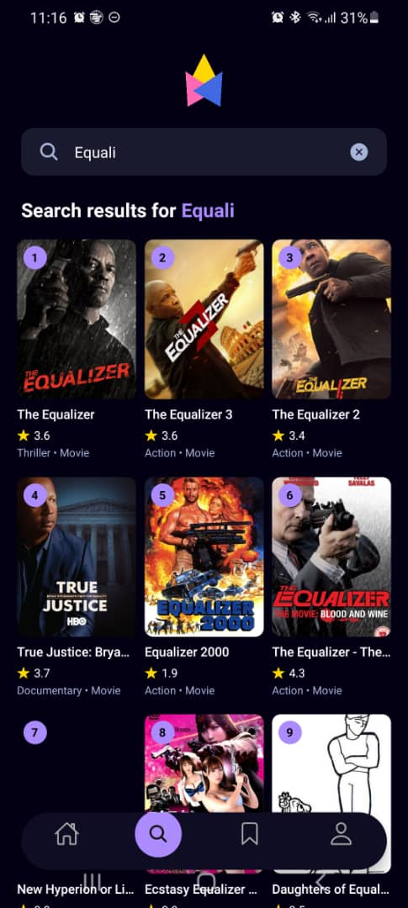

# 🎬 Mobile Movie App

A beautiful, feature-rich mobile movie discovery app built with React Native and Expo. Browse popular movies, search for your favorites, and save them for later!

<!-- Add your app logo/banner here -->
<!--  -->

## ✨ Features

- 🔥 **Discover Popular Movies** - Browse trending and popular movies from TMDB
- 🔍 **Smart Search** - Search through 300+ movies with real-time results
- 🎭 **Genre Filtering** - Filter movies by genre (Action, Comedy, Horror, etc.)
- 📖 **Detailed Movie Info** - View comprehensive movie details including cast, crew, and ratings
- 📍 **Where to Watch** - Find streaming platforms where you can watch each movie
- 💾 **Save Favorites** - Bookmark movies to watch later (persists across app restarts)
- 🌙 **Beautiful Dark Theme** - Easy on the eyes with a stunning purple accent design

## 📱 Screenshots

<!-- Replace these placeholders with your actual screenshots -->
<!-- Recommended: Create an 'assets/screenshots' folder and add your images there -->

| Home Screen | Search Screen | Movie Details |
|:-----------:|:-------------:|:-------------:|
|  |  |  |  |

| Saved Movies | Search Example | Genre Filter |
|:------------:|:---------------:|:------------:|
|  |  |


## 🛠️ Tech Stack

- **Framework:** [React Native](https://reactnative.dev/) with [Expo](https://expo.dev/)
- **Navigation:** [Expo Router](https://docs.expo.dev/router/introduction/) (File-based routing)
- **Styling:** [NativeWind](https://www.nativewind.dev/) (TailwindCSS for React Native)
- **API:** [TMDB API](https://www.themoviedb.org/documentation/api) (The Movie Database)
- **Storage:** [AsyncStorage](https://react-native-async-storage.github.io/async-storage/) (Persistent local storage)
- **Language:** TypeScript

## 📁 Project Structure
mobile_movie_app/
├── app/ # App screens (file-based routing)
│ ├── _layout.tsx # Root layout with navigation
│ ├── index.tsx # Entry redirect
│ ├── (tabs)/ # Tab navigation screens
│ │ ├── _layout.tsx # Tab bar configuration
│ │ ├── index.tsx # Home screen
│ │ ├── search.tsx # Search screen
│ │ ├── saved.tsx # Saved movies screen
│ │ └── profile.tsx # Profile screen
│ └── movies/
│ └── [id].tsx # Movie details (dynamic route)
├── assets/
│ └── images/ # App images and icons
├── context/
│ └── SavedMoviesContext.tsx # Saved movies state management
├── services/
│ ├── api.ts # TMDB API functions
│ └── useFetch.ts # Custom fetch hook
└── ...config files


## 🚀 Getting Started

### Prerequisites

- Node.js (v18 or newer)
- npm or yarn
- Expo CLI
- Android Studio (for Android emulator) or Xcode (for iOS simulator)
- [Expo Go](https://expo.dev/go) app on your physical device (optional)

### Installation

1. **Clone the repository**
   ```bash
   git clone https://github.com/yourusername/mobile_movie_app.git
   cd mobile_movie_app

2. **Install dependencies**
   ```bash
   npm install

3. **Set up environment variables**
   create a `.env` file in root directory:
   ```bash
   EXPO_PUBLIC_MOVIE_API_KEY=your_tmdb_api_key_here

4. **Start the development server**
   ```bash
   npx expo start

5. **Run the app**
  - Press a for Android emulator
  - Press i for iOS simulator
  - Scan QR code with Expo Go app on your phone


##🔑 API Configuration
This app uses the TMDB (The Movie Database) API. To get your API key:

1. Create an account at themoviedb.org
2. Go to Settings → API → Create → Developer
3. Copy your API Read Access Token
4. Add it to your .env file

###📱 App Features Breakdown
Home Screen
- Displays popular movies in a grid layout
- Shows latest/now playing movies
- Search bar for quick access to search
- Ranking badges on top movies
Search Screen
- Real-time search with debouncing
- Genre filter pills (Adventure, Action, Comedy, etc.)
- Results displayed in a 3-column grid
- Movie ratings and genres shown
Movie Details
- Hero image with gradient overlay
- Movie metadata (year, runtime, rating)
- Genre tags
- Full synopsis/overview
- Director information
- Cast carousel with profile images
- Where to Watch - Streaming, rent, and buy options
- Bookmark button to save movies
Saved Screen
- Grid view of all bookmarked movies
- Quick remove functionality
- Empty state with call-to-action
- Persistent storage (survives app restart)


###🤝 Contributing
Contributions are welcome! Please feel free to submit a Pull Request.

Fork the project
- Create your feature branch (git checkout -b feature/AmazingFeature)
- Commit your changes (git commit -m 'Add some AmazingFeature')
- Push to the branch (git push origin feature/AmazingFeature)
- Open a Pull Request

📄 License
This project is licensed under the MIT License - see the LICENSE file for details.

🙏 Acknowledgments
TMDB for the movie data API
Expo for the amazing development platform
Ionicons for the beautiful icons